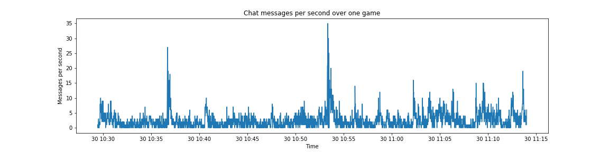
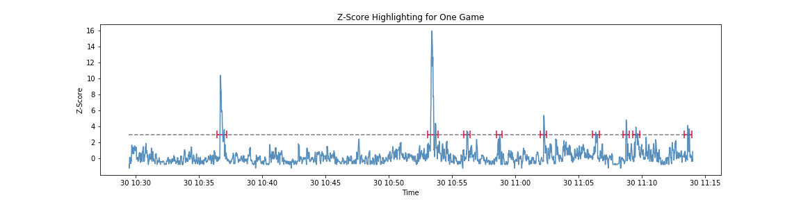
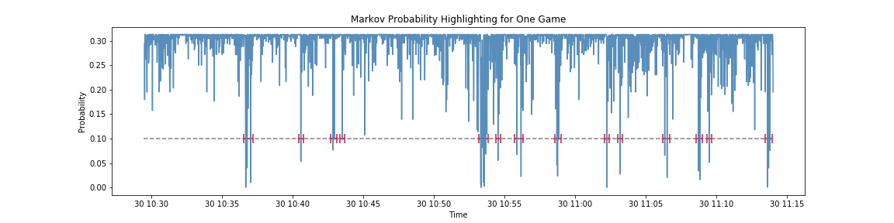
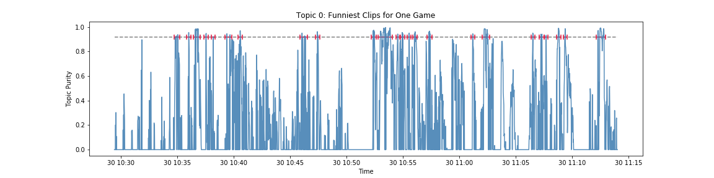
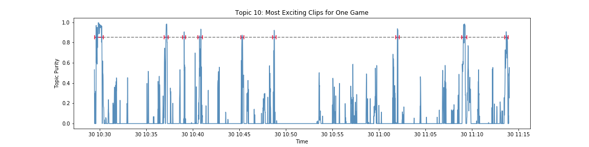

# Final Report

This report repeats most of what is found in the notebook headings within the `code` directory, as well as some interpretations found in section subheadings. Read the `README.md` for a quick introduction to Twitch as well as some useful terminology.

## Problem Statement
---

> Watching a Twitch stream can be fun way to interact with streamers, the people in chat, and watch some video games while you're at it. However, due to their unedited nature, Twitch streams can be exceptionally long and may not be 100% filled with entertainment. For someone that does not have a lot of time on their hands, they may not be able to watch their favorite streamers live and are not willing to look through hours of VOD content to find the most entertaining segments of the stream.

The solution to this is to crowdsource the video highlighting process to Twitch chat.

## Data Gathering
---

The raw messages are scraped from Twitch in real time, where they are then written to a `.log` file along with a timestamp that is sensitive down to the second. The messages are then processed into a pandas dataframe using a regular expression, and message per second data was calculated based on this dataframe.

After running the scrape, I found some issues with the Python socket object. Namely, the socket can get "backed up" and start returning multiple messages on the same timestamp. This is not too much of an issue for the most part, as the clogs will sort themselves out relatively quickly. However, this becomes a much larger issue if the chat is extremely busy, such as the second scrape I attempted. The data that I have is functional but were I to conduct this scrape again, I would just take the chat from the VOD, as all of the video editing was done on the VOD anyways.

> This plot shows the general shape of the raw message-per-second data after it has been scraped. Periods of relatively low activity are broken up by large spikes, often triggered in reaction to something happening in the stream itself. The chat resembles a crowd at a sports stadium, where the murmur of the crowd is broken up by loud cheering and yelling when the home team makes an outstanding play.

## Anomaly Detection
---

I look at a couple methods of flagging highlights using anomaly detection techniques. When looking at a time series plot of the message per second data, potential highlights take the form of spikes in the ambient noise. This makes the data ideal for an anomaly detection analysis, where the highlights are the anomalies. The methods are lsited here, in order of complexity.

1. __Z-Scores:__

> This basic method looks at the magnitude of the spikes and assigns them a highlight flag if they pass a certain threshold. While simple, this technique works quite well and can accurately identify all of the most important clips, and it is also the fastest of the three, making this method great for quickly marking down a long vod. However, it does have some drawbacks, most of which arise from trying to analyse a smaller portion of video.

> This shows the z-score highlighting for one game, a total duration of about 45 minutes. Note that at a threshold of 3, there is only one clip in the first 50% of the game. There are some smaller spikes in between the two large spikes that might help to provide some context for the rest of the reel. However, were the threshold made any lower, it might start to pick up the random noise near the end of the game, which would result in many clips being made, or a few clips that are very long. Either solution may be fine depending on your preferences, but it is possible to reach a middle ground using the next technique.

2. __Markov Chains:__

> This technique calculates the likelihood of the next value of the messages per second. In theory, highlights are thought to have a low probability of occuring. When such an event occurs, it is flagged as a highlight. This technique performs well at extracting smaller spikes from the ambient noise, but as a result may return many clips. This technique is slightly slower but great for marking down smaller segments of a vod, about 1 hour or less.

>To do this, I used a Gaussian distribution with a mean at the current value of MPS, then calculated the probability of next value using the probability density function. As an example, say that the current messages per second is 3. If the next value is 4, then there will be a high probability of this event occuring. The mean of the Guassian distribution is then updated to 4. However, if the next value is 15, there is a very low probability of this event happening, and it will be flagged by the highlighter.

> This plot shows the probabilities of the next value of messages-per-second, given the current messages-per-sec. Right away, it is easy to tell that this method of highlighting produces more spikes than z-score thresholds; in particular, those between 10:40 and 10:50, are exaggerated to the point that they can be picked up by the highlighter without the random noise towards the end being picked up as well.

3. __Latent Dirichlet Allocation:__

> This method utilizes the content of the chat message as well as the message-per-second data. Using topic modeling allows for highlighting based on the topic being discussed in chat at any given time. I use Latent Dirichlet Allocation to identify "topic anomalies". These can be used to highlight based on what the topic of chat is at that moment in time. For example, if I only wanted to see the funniest moments I could highlight solely based on the topic that the LDA algorithm decided was the "funny" topic. I could do the same thing for an "exciting" topic if I wanted to see the most pivotal plays across the entire stream. Determining the topic is primarily done with emotes, which convey a variety of emotions and generally show up next to each other within the spikes in activity.

> This plot shows the entire stream marked down with the funniest moments. Note that the topic was not automatically determined to be "the funny topic"; determining this required human intervention.

> The highlights for this topic are much sparser than the ones for the last topic. Perhaps this game was not so much a display of skill, but rather a comedy of errors?

## Video Editing
---

After generating highlight flags out of the data set, they are fed into the easy-to-use Python library moviepy. The generated videos unfortunately do not fit on GitHub as they are over 100MB. You can generate them yourself using `04_video_editing.ipynb` in the `code/` directory, but be warned that this is time-consuming and resource intensive for your computer. 

## Summary
---

Lacking any hard and fast metric to test my generated highlight reels against, it would seem that I would be unable to conclusively say how successful my methods are. However, I chose this particular one-game segment for a specific reason; the streamer from whom I pulled the data from, AdmiralBulldog, has a video editor that he pays to do the job that I am currently trying to automate. After the stream ended, the editor uploaded his own highlight reel onto YouTube. I compared my generated reels against his to "evaluate" my methods. As mentioned previously, each anomaly detection technique has its own strengths and weaknesses. 

### Possible Evaluation

It should be possible to play the two videos next concurrently and have a computer generate a "similarity" score, or take a look at the events that occurred in the official highlight reel and check whether or not they were encompassed by the generated highlight reel. However, this would require human intervention or video editing skills that I currently lack. Alternatively, if the system was made more robust, the highlights could be uploaded to a different video hosting website (i.e. YouTube) and then examine the like/dislike ratio to determine how effective it is. 

